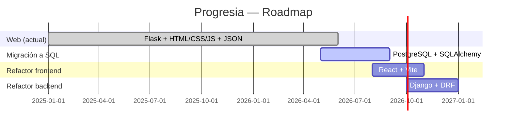

# Progresia — Gestor de Tareas con Gamificación

**Progresia** es un gestor de tareas con mecánicas RPG que comenzó como CLI en Python y está en plena transición a aplicación web. Actualmente conviven una interfaz de consola y una versión web con Flask (HTML + CSS + JavaScript vanilla). Todo el backend está en Python con persistencia en JSON.

La hoja de ruta a futuro incluye migrar a PostgreSQL, separar frontend con React, y reemplazar Flask por Django.

---

## Stack actual

| Capa        | Tecnología                     |
|-------------|--------------------------------|
| Backend     | Python 3.10+, Flask            |
| Frontend    | HTML5, CSS3, JavaScript vanilla|
| Templates   | Jinja2                         |
| Persistencia| JSON (9 archivos)              |
| CLI (legacy)| Python, colorama               |

---

## Características

#### Sistema de usuarios
- Registro, inicio de sesión, edición de perfil y eliminación de cuenta
- Atributos: vida, XP, coins, maná, nivel, clase, foto de perfil y personaje
- Sesión persistente configurable (30 días)
- Validación robusta de contraseñas (mayúsculas, números, símbolos, mín. 8 caracteres)

#### Gestión de tareas
- Tres tipos: **hábitos** (+/−), **diarias** (se reinician cada día), **pendientes** (con fecha de vencimiento)
- CRUD completo desde el dashboard web
- Penalización automática al fallar diarias/pendientes vencidas
- Búsqueda y filtrado por tipo

#### Gamificación
- Recompensas al completar tareas: XP, coins, maná, ítems aleatorios
- Penalizaciones al fallar: pérdida de vida, XP y coins
- Las penalizaciones escalan con el nivel del usuario
- Sistema de niveles y prestigio (reinicio al nivel 100)

#### Clases y Poderes
- Al llegar al nivel 10 se desbloquea la selección de clase
- Clases disponibles: Guerrero, Mago, Sanador, etc. (con variantes VIP)
- Cada clase tiene poderes únicos que consumen maná
- Los poderes se equipan desde el menú correspondiente

#### Mascotas
- Al completar tareas hay probabilidad de obtener un huevo de mascota
- Ciclo de vida: huevo → bebé → adulta → montura
- Se alimentan con ítems obtenidos en tareas o comprados en la tienda
- Requieren poción de eclosión para nacer

#### Tienda e Inventario
- Catálogo de ítems con paginación (56 ítems por página)
- Compra y venta de ítems con coins
- Los ítems se pueden equipar (armadura, arma, accesorio) o usar (consumibles)
- Efectos de ítems en estadísticas del usuario

#### Notificaciones
- Sistema interno de notificaciones por usuario
- Marcar como leídas o eliminar
- Notificaciones de eventos: nivel subido, prestigio, bonus VIP, expiración

#### Sistema VIP
- Suscripción premium con bonus diarios y recompensas mensuales
- Clases y poderes exclusivos para VIP
- Control de expiración automática

---

## Estructura del proyecto

```
gestor_tareas_cli_menu/
│
├── app.py                    # Aplicación Flask (rutas web)
├── menu_login.py             # Menú CLI: login/registro
├── menu_tareas.py            # Menú CLI: CRUD de tareas
├── menu_inventario.py        # Menú CLI: inventario
├── menu_tienda.py            # Menú CLI: tienda
├── menu_mascotas.py          # Menú CLI: mascotas
├── menu_poderes.py           # Menú CLI: poderes de clase
│
├── usuario.py                # Clase Usuario
├── gestor_usuarios.py        # Gestor de usuarios
├── tareas.py                 # Clase Tarea
├── gestor_tareas.py          # Gestor de tareas
├── constantes_tareas.py      # Constantes de XP, coins, vida, maná
├── inventario.py             # Clase Inventario
├── gestor_inventario.py      # Gestor de inventarios
├── item.py                   # Clase Item
├── tienda.py                 # Clase Tienda
├── recompensa.py             # Clase Recompensa
├── gestor_recompensa.py      # Gestor de recompensas
├── mascotas.py               # Clase Mascota
├── gestor_mascotas.py        # Gestor de mascotas
├── clases.py                 # Clases y poderes
├── notificaciones.py         # Clase Notificacion
├── gestor_notificaciones.py  # Gestor de notificaciones
├── utils_rutas.py            # Utilidad de rutas JSON
│
├── static/
│   ├── css/
│   │   ├── style.css         # Estilos globales
│   │   ├── home.css          # Landing page
│   │   ├── dashboard.css     # Dashboard de tareas
│   │   ├── inventario.css    # Inventario
│   │   ├── mascotas.css      # Mascotas
│   │   ├── tienda.css        # Tienda
│   │   └── soloregister.css  # Registro standalone
│   ├── js/
│   │   ├── base.js           # Toast notifications
│   │   ├── dashboard.js      # Interacciones del dashboard
│   │   ├── inventario.js     # Lógica de inventario
│   │   └── tienda.js         # Lógica de tienda
│   └── images/
│       ├── logo.png
│       ├── logo.ico
│       ├── footer-progresia.png
│       ├── PersonajesLogin.png
│       ├── masculino.png / femenino.png
│       ├── muerte_placeholder.png
│       └── banners (6)
│
├── templates/
│   ├── base.html             # Layout base con nav/sidebar
│   ├── home.html             # Landing / login
│   ├── solologin.html        # Login standalone
│   ├── soloregister.html     # Registro standalone
│   ├── setup_profile.html    # Setup inicial de perfil
│   ├── dashboard.html        # Panel principal de tareas
│   ├── estadisticas.html     # Estadísticas del usuario
│   ├── inventario.html       # Inventario e equipamiento
│   ├── tienda.html           # Tienda con catálogo
│   ├── mascotas.html         # Gestión de mascotas
│   ├── poderes.html          # Poderes de clase
│   └── perfil.html           # Perfil de usuario
│
├── json/
│   ├── usuarios.json
│   ├── tareas.json
│   ├── inventarios.json
│   ├── items.json
│   ├── recompensas.json
│   ├── clases.json
│   ├── mascotas.json
│   ├── inventario_mascotas.json
│   └── notificaciones.json
│
├── requirements.txt          # colorama (solo para CLI)
├── .gitignore
└── README.md
```

---

## Configuración inicial

1. Copiar `.env.example` a `.env` y ajustar valores:
   ```bash
   cp .env.example .env
   ```
2. El archivo `.env` **no se sube a GitHub** (está en `.gitignore`). Contiene:
   - `SECRET_KEY`: clave para firmar sesiones (cambiar por una segura en producción)
   - `FLASK_ENV`: `development` o `production`

---

## Instalación y uso

### CLI (legacy)
```bash
pip install -r requirements.txt
python menu_login.py
```

### Web (Flask)
```bash
pip install flask werkzeug python-dotenv
python app.py
# Abrir http://127.0.0.1:5000
```

> **Datos sensibles**: los archivos JSON con datos reales de usuarios (`usuarios.json`, `tareas.json`, etc.) están en `.gitignore` y no se suben a GitHub.  
> En `json/` hay archivos `*_ejemplo.json` con datos ficticios para que quienes clonen el repo vean la estructura esperada de cada módulo: `usuarios_ejemplo.json`, `tareas_ejemplo.json`, `inventarios_ejemplo.json`, `clases_ejemplo.json`, `items_ejemplo.json` y `mascotas_ejemplo.json`.

---

## Roadmap



1. **Python → Flask + HTML/CSS/JS + JSON** ← (etapa actual, en curso)
2. **JSON → PostgreSQL con SQLAlchemy** — migrar toda la persistencia a base de datos relacional
3. **Frontend vanilla → React** — componentes reutilizables, estado global, mejor experiencia
4. **Flask → Django + Django REST Framework** — backend robusto con ORM, admin, autenticación avanzada

---

## Contribución

1. Fork del repositorio
2. Rama por feature (`git checkout -b feature/lo-que-sea`)
3. Commit (`git commit -m 'Agrega X'`)
4. Push (`git push origin feature/lo-que-sea`)
5. Pull Request

---

## Licencia

MIT — ver archivo [LICENSE](LICENSE).

---

## Autor

**Luis Paisio** — [LinkedIn](https://www.linkedin.com/in/luis-paisio)

Proyecto de portfolio técnico.
